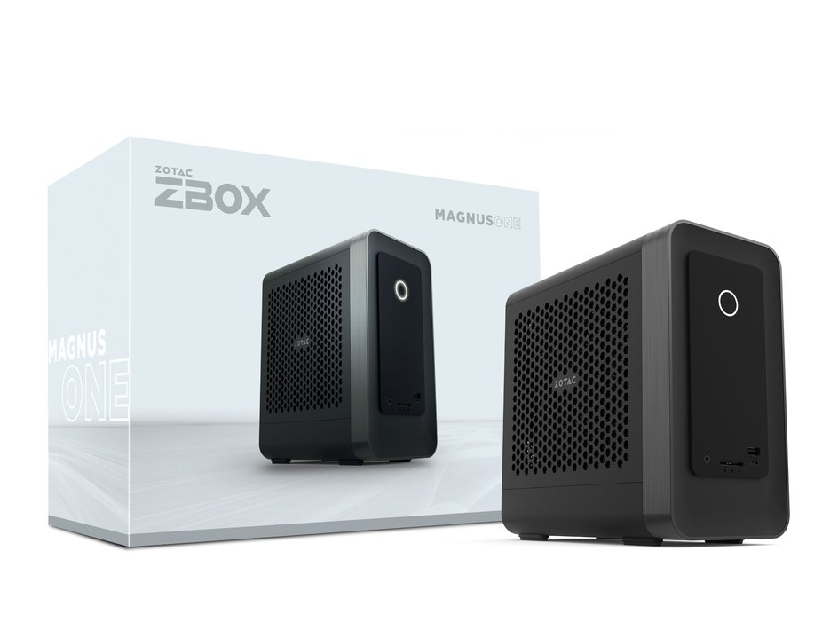
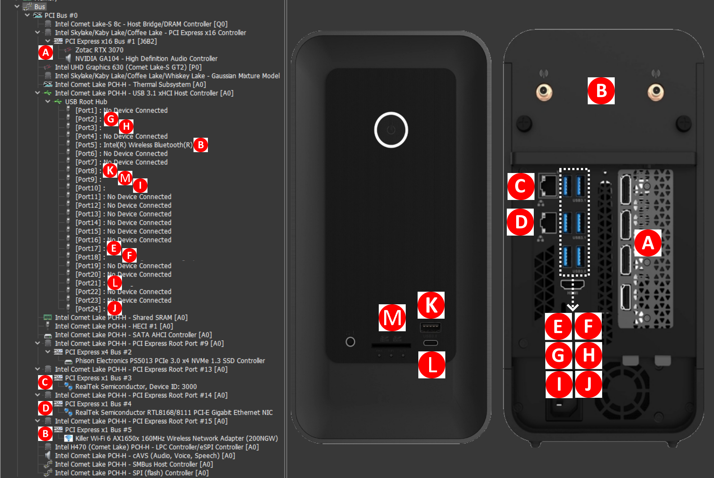

# 	ZOTAC MAGNUS ONE ZBOX-ECM73070C (Barebone) Hackintosh

This repository is about hackintosh on **ZOTAC MAGNUS ONE ZBOX-ECM73070C** without eGPU.

## Hardware

* Motherboard: ZOTAC ZBOX-ECM73070C/53060C
 * Ethernet: Killer E3000 2.5 Gigabit Ethernet Controller
 * Ethernet: Realtek RTL8168/8111 PCI-E Gigabit Ethernet Adapter
 * Wi-Fi/BT: Killer Wi-Fi 6 AX1650x 160MHz Wireless Network Adapter (200NGW)
 * Audio: Realtek ALC269
* CPU: Intel i7-10700
* Chipset: Intel H470
* iGPU: Intel UHD630
* RAM: Kingston Fury DDR4-2933 KF2933C17S4/16G 32GB(16G×2)
* SSD: Kingston SKC2500M81000G (1000 ГБ, PCI-E 3.0 x4)

## Software

* Bootloader: Clover
* OS: macOS Monterey 12.0.1

## What's working

- [x] Intel UHD630 (iGPU)
- [x] Ethernet 0 Audio Realtek ALC269
- [x] Ethernet 1 Realtek RTL8168/8111 PCI-E Gigabit Ethernet Adapter
- [x] Wi-Fi Killer Wi-Fi 6 AX1650x
- [x] USB
- [x] Sleep/Wake
- [x] Restart/Shutdown

## What's NOT working

- [x] Bluetooth

## Details

### GPU

iGPU Intel UHD 630

### BIOS

> Version: 03/22/2021 12:24:00

#### Disable

* Fast Boot
* CSM
* SGX

#### Enable

* EHCI/XHCI Hand-off

## Misc

### Devices Layout

### Installation

1. Go to App Store on any MacOS device, search and download "Monterey MacOS" without installation.
2. Create bootable installer USB-stick for macOS https://support.apple.com/en-in/HT201372
3. Mount EFI partition https://github.com/corpnewt/MountEFI
4. Clone https://github.com/farcop/hackintosh
5. Copy EFI folder from this repo to EFI partition.
6. Boot from USB-stick and install MacOS. 
